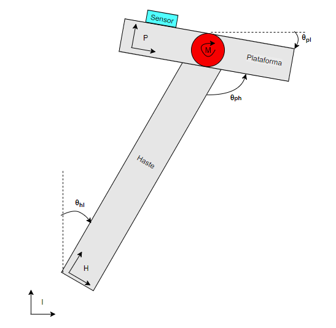

# Estabilizador Inercial
Estabilização de uma plantaforma utilizando motor DC e a STM32F4 Discovery. 
## Conceito e Motivação
Plataformas inercialmente estabilizadas são aplicadas para apontar e estabilizar a linha de visada de diversos tipos de sensores, câmeras, telescópios, antenas de comunicação e armamentos. Objetiva-se estabilizar uma plataforma com motor DC utilizando a STM32F4 Discovery e o acelerômetro/girocópio MPU-9250. Para tal, será feita a modelagem do motor e implementação de um controle PID, embarcado na placa, controle esse com constantes que podem ser ajustadas via serial e posterior desenvolvimento de um protótipo funcional.
##### Motivação Secundária
Poder realizar a medição da aceleração e da velocidade com que qualquer corpo está se movendo. Como por exemplo realizar essas medições para os robô da equipe roboime da categoria SSL de futebol de robôs. Assim tendo uma maneira alternativa para a realimentação de sua malha de controle.

## Descrição do Problema

Faremos uma simplificação para um problema envolvendo apenas um grau de liberdade. O sistema está representado na figura abaixo:

O objetivo será estabilizar a direção da linha de visada da plataforma, $$\theta_{pI}$$, em um valor fixo de referência $$\theta_{r}$$, tipicamente $$0\,^{\circ}$$. Onde a haste poderá se mover livremente em um certo intervalo angular e o motor exercerá o papel de se contrapor ao seu movimento estabilizando a plataforma. Assim:

$$\theta_{pI} = \theta_{ph} + \theta_{hI} = \theta_{r}$$

Fixando o sensor inercial na plataforma pode-se medir diretamente o ângulo que queremos estabilizar, $$\theta_{pI}(t)$$. Conforme é mostrado na figura abaixo, controlamos a variável $$\theta_{ph}(t)$$ por meio do motor e o movimento da haste, $$\theta_{hI}(t)$$, é visto como uma pertubação na saída do sistema. Desse modo não se faz necessário o uso de encoders, uma vez que não precisamos medir o sinal $$\theta_{ph}(t)$$. Como o sensor inercial mede diretamente a direção da linha de visada da plataforma, é possível a correção de distúrbios que atuem em cima da plataforma.

A saída $$y(t) = \theta_{pI}(t)$$ deve tentar alcançar o sinal de entrada/referência $$r(t) = \theta_{r}(t)$$ e rejeitar a perturbação $$w(t) = \theta_{hI}(t)$$. Dessa forma temos a função de transferência do sistema, onde C(s) e P(s) são as funções de transferência do controlador e da planta respectivamente:

$$\frac{Y(s)}{R(s)} = \frac{C(s)P(s)}{1 + C(s)P(s)}$$

## Diagrama de Blocos do Projeto

Para base de produção do fimrware será utilizada uma placa produzida pelo Aluno Onias Castelo, membro da RoboIME com suporte da IMBEL-FMCE e uma STM32F4Discovery produzida pela ST. A placa conta com, além do MPU-9250, um extensor de porta STMPE811, via I2C conectado a um display de 7-segmentos, um botão, dois LEDs e um conector para cartão microSD. Além disso será utilizado um motor e um módulo de motor.

Os periféricos a serem utilizados se comunicaram com o microcontrolador de acordo com o diagrama de blocos abaixo.

### Interface com o Usuário

Será feita uma interface em labview para q a resposta do sistema possa ser visualizada e em tempo real as constantes da malha de controle ajustadas.
 
## Referências

[MPU-9250 Datasheet][mpu]

[STM32F4Discovery][stm32f4]

[//]: # (These are reference links used in the body of this note and get stripped out when the markdown processor does its job. There is no need to format nicely because it shouldn't be seen. Thanks SO - http://stackoverflow.com/questions/4823468/store-comments-in-markdown-syntax)

   [mpu]: <https://www.invensense.com/products/motion-tracking/9-axis/mpu-9250/>
   [globo-esporte]: <http://globoesporte.globo.com/eu-atleta/saude/noticia/2016/03/voce-sabe-o-que-e-cadencia-da-corrida-e-como-ela-pode-ajudar.html>
   [stm32f4]: <http://www.st.com/en/evaluation-tools/stm32f4discovery.html#sw-tools-scroll>
   [stmpe811]: <https://br.mouser.com/datasheet/2/389/stmpe811-1309299.pdf>
   [markdown-it]: <https://github.com/markdown-it/markdown-it>      
   [PlDb]: <https://github.com/joemccann/dillinger/tree/master/plugins/dropbox/README.md>
   [PlGh]: <https://github.com/joemccann/dillinger/tree/master/plugins/github/README.md>
   [PlGd]: <https://github.com/joemccann/dillinger/tree/master/plugins/googledrive/README.md>
   [PlOd]: <https://github.com/joemccann/dillinger/tree/master/plugins/onedrive/README.md>
   [PlMe]: <https://github.com/joemccann/dillinger/tree/master/plugins/medium/README.md>
   [PlGa]: <https://github.com/RahulHP/dillinger/blob/master/plugins/googleanalytics/README.md>
